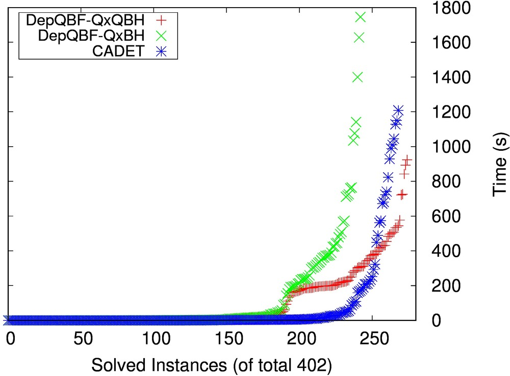

### OVERVIEW ###

QRATPre+ is a novel preprocessor to simplify quantified Boolean formulas (QBFs)
given in prenex conjunctive normal form (PCNF). For simplification, QRATPre+
tries to eliminate redundant clauses from the PCNF, or universal literals from
clauses. It implements redundancy checking based on the QRAT+ proof
system. QRAT+ is a generalisation of the QRAT proof system. QRAT was introduced by
Heule, Seidl, and Biere:

* M. Heule, M. Seidl, A. Biere: Solution Validation and Extraction for QBF
  Preprocessing. J. Autom. Reasoning 58(1), 2017.

* M. Heule, M. Seidl, A. Biere: A Unified Proof System for QBF
  Preprocessing. JCAR 2014.

QRATPre+ is the _first available implementation_ of the QRAT/QRAT+ proof systems for redundancy removal in QBF preprocessing.

For redundancy checking, the QRAT+ system relies on QBF-specific unit
propagation with universal reduction to handle the literals of certain
universal variables. This is in contrast to QRAT, which applies propositional
unit propagation and treats every variable as existentially quantified. As a
result, redundancy removal based on QRAT+ is more powerful than based on QRAT.

### PUBLICATIONS ###

A tool paper related to QRATPre+ appeared at [SAT 2019](http://sat2019.tecnico.ulisboa.pt/):

* Florian Lonsing and Uwe Egly. QRATPre+: Effective QBF Preprocessing
  via Strong Redundancy Properties. In Proc. of the 22nd International
  Conference on Theory and Applications of Satisfiability Testing
  (SAT) 2019, Springer, LNCS. Preprint: [https://arxiv.org/pdf/1904.12927.pdf](https://arxiv.org/pdf/1904.12927.pdf).

The theory behind QRATPre+ is described in our 
[IJCAR 2018](http://ijcar2018.org/) paper:

* Florian Lonsing and Uwe Egly. QRAT+: Generalizing QRAT by a More Powerful
QBF Redundancy Property. In Proc. of the 9th International Joint Conference on
Automated Reasoning (IJCAR) 2018, Springer, LNCS. Preprint: [https://arxiv.org/pdf/1804.02908](https://arxiv.org/pdf/1804.02908).

### QRATPRE+ IN QBFEVAL'18 ###



The cactus plot above shows the runtimes of the solvers
*DepQBF-QxQBH*, *DepQBF-QxBH*, and *CADET* on the instances from the
2QBF track of [QBFEVAL
2018](http://www.qbflib.org/qbfeval18.php). [CADET](https://github.com/MarkusRabe/cadet)
is a state-of-the-art 2QBF solver. DepQBF-QxQBH and DepQBF-QxBH are
packages consisting of the QCDCL solver
[DepQBF](http://lonsing.github.io/depqbf/) and a preprocessing module
that integrates several QBF preprocessors. The preprocessing module is
implemented as a shell script called
[QBFRelay](https://github.com/lonsing/qbfrelay). Variant
*DepQBF-QxQBH* includes QRATPre+ whereas variant *DepQBF-QxBH* does
not.

As can be seen from the plot, the use of QRATPre+ in variant
*DepQBF-QxQBH* is crucial to achieve top performance. Thanks to
QRATPre+, *DepQBF-QxQBH* won the 2QBF track in QBFEVAL 2018. While
*DepQBF-QxQBH* solved 275 instances, *DepQBF-QxBH* solved only 243. It
is remarkable that CADET solved 269 *without* any preprocessing.

Note on practical applications (disclaimer): in contrast to CADET,
DepQBF-QxQBH and DepQBF-QxBH do not produce certificates.

### SOURCE CODE ###

QRATPre+ is free software released under GPLv3:

[https://www.gnu.org/copyleft/gpl.html](https://www.gnu.org/copyleft/gpl.html)

The latest release is available from
[GitHub](https://github.com/lonsing/qratpreplus).

* March 2019: [Version 2.0](https://github.com/lonsing/qratpreplus/archive/version-2.0.tar.gz)

### EXEMPLIFYING THE POWER OF THE QRAT+ SYSTEM ###

The following examples illustrate that redundancy removal based on QRAT+ as implemented in QRATPre+ is more powerful than based on QRAT.

#### Clause Elimination ####

Suppose that we have a file `formula.qdimacs` containing the following QBF in [QDIMACS](http://www.qbflib.org/qdimacs.html) format:

```
p cnf 12 14
e 1 2 7 8 0
a 3 9 0
e 4 10 0
a 5 11 0
e 6 12 0
1 3 -4 0
2 -3 4 0
-1 -3 -4 0
-2 3 4 0
3 -4 6 0
-5 -6 0
-1 5 -6 0
7 9 -10 0
8 -9 10 0
-7 -9 -10 0
-8 9 10 0
9 -10 12 0
-11 -12 0
-7 11 -12 0
```

QRATPre+ is able to remove _all_ clauses in `formula.qdimacs`. The call `./qratpre+ --print-formula ./formula.qdimacs` produces the following output: 

```
p cnf 0 0
```

Now we configure QRATPre+ to apply redundancy detection based on the QRAT system instead of QRAT+ by parameter `--no-eabs`. The formula produced by calling `./qratpre+ --print-formula --no-eabs ./formula.qdimacs` is exactly the same as the given one, i.e., _no_ redundant clauses can be detected using the QRAT system:

```
p cnf 12 14
e 1 2 7 8 0
a 3 9 0
e 4 10 0
a 5 11 0
e 6 12 0
1 3 -4 0
2 -3 4 0
-1 -3 -4 0
-2 3 4 0
3 -4 6 0
-5 -6 0
-1 5 -6 0
7 9 -10 0
8 -9 10 0
-7 -9 -10 0
-8 9 10 0
9 -10 12 0
-11 -12 0
-7 11 -12 0
```

Hence clause elimination based on the QRAT+ proof system is more powerful than based on QRAT (see also Proposition 4 in our related [IJCAR 2018 paper](https://arxiv.org/pdf/1804.02908)).

#### Universal Literal Elimination ####

Like above, suppose that we have a file `formula.qdimacs` containing the following QBF in [QDIMACS](http://www.qbflib.org/qdimacs.html) format:

```
p cnf 6 8
a 1 2 0
e 3 4 0
a 5 0
e 6 0
-2 -3 -4 0
-1 -3 4 0
1 3 -4 0
2 3 4 0
-3 -4 6 0
5 -6 0
-3 4 -6 0
-5 6 0
```

We configure QRATPre+ to only eliminate universal literals by parameters `--no-qbce --no-qrate --no-qat`, thus switching off clause elimination techniques. QRATPre+ is able to remove _all_ universal variables appearing in the first quantifier block `a 1 2 0` from `formula.qdimacs`. The call `./qratpre+ --print-formula --no-qbce --no-qrate --no-qat ./formula.qdimacs` produces the following output: 

```
p cnf 6 8
e 3 4 0
a 5 0
e 6 0
-3 -4 0
-3 4 0
3 -4 0
3 4 0
-3 -4 6 0
5 -6 0
-3 4 -6 0
-5 6 0
```

In contrast to that, if we apply the QRAT system instead of QRAT+ by parameter `--no-eabs`, then _no_ universal variables can be removed. The formula produced by calling `./qratpre+ --print-formula --no-qbce --no-qrate --no-qat --no-eabs ./formula.qdimacs` is exactly the same as the given one:

```
p cnf 6 8
a 1 2 0
e 3 4 0
a 5 0
e 6 0
-2 -3 -4 0
-1 -3 4 0
1 3 -4 0
2 3 4 0
-3 -4 6 0
5 -6 0
-3 4 -6 0
-5 6 0
```

Hence universal literal elimination based on the QRAT+ proof system is more powerful than based on QRAT (see also Proposition 5 in our related [IJCAR 2018 paper](https://arxiv.org/pdf/1804.02908)).


### CONTACT INFORMATION ###

For comments, questions, bug reports etc. related to QRATPre+, please contact:

Florian Lonsing, Stanford University, US

[http://www.florianlonsing.com/](http://www.florianlonsing.com/)
